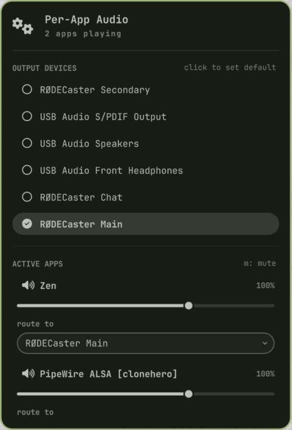
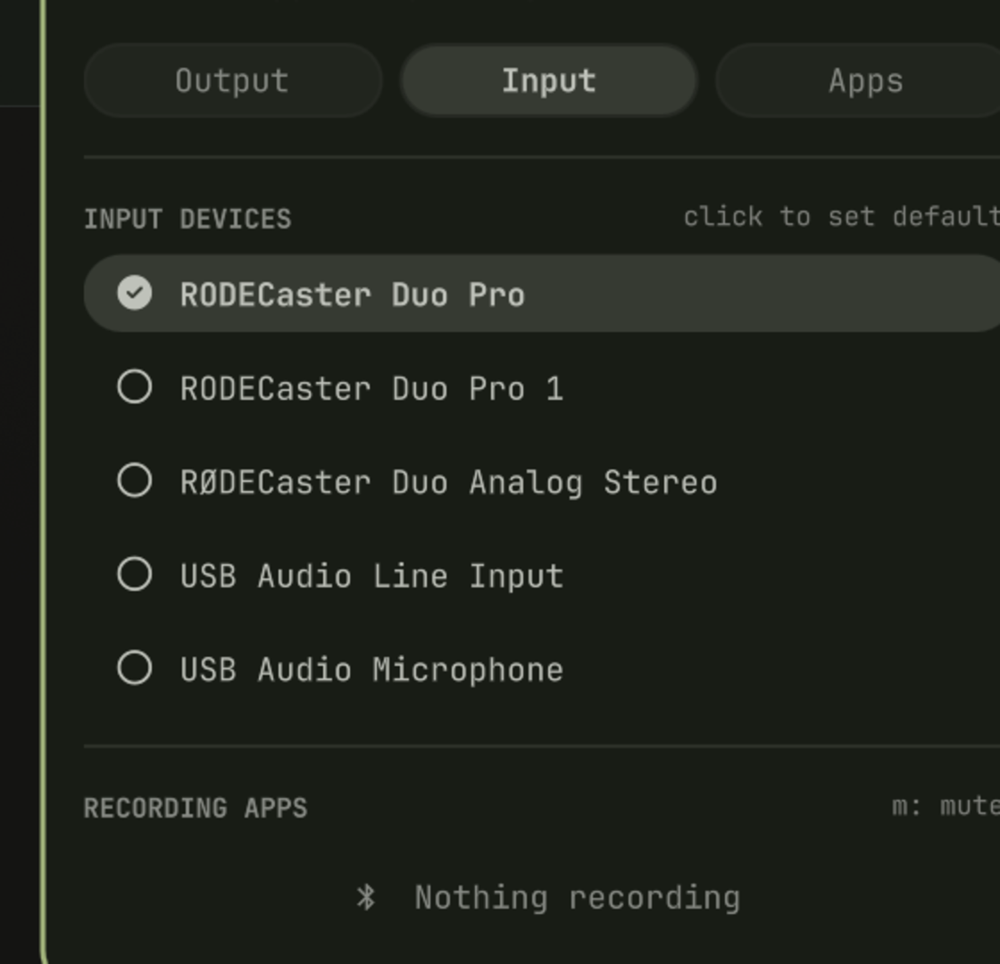
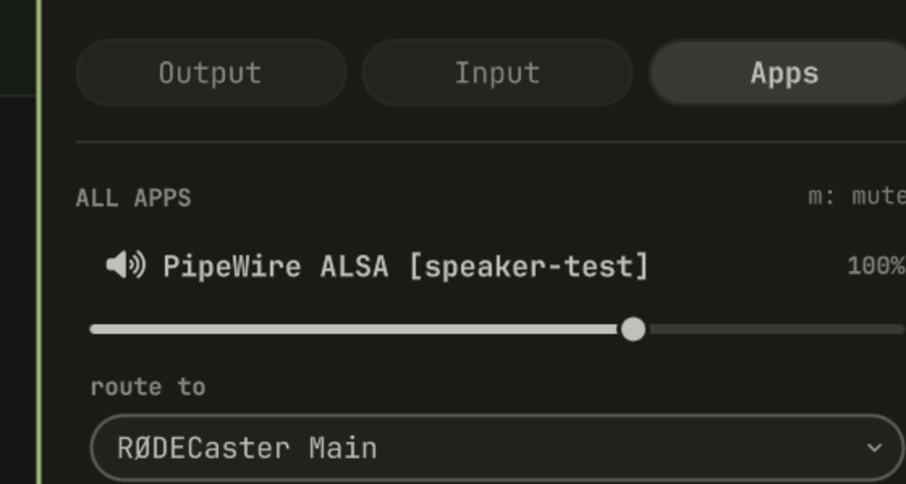

# Per-App Audio — EarTrumpet-style routing for Omarchy

Route each individual application to a different audio output **or** input
device, adjust per-app volume and mute, and pick your system default in both
directions — all from a single bar widget. Inspired by
[EarTrumpet](https://github.com/File-New-Project/EarTrumpet).



The panel has three tabs — output, input, and a combined view of every app:

| Output | Input |
| :----: | :---: |
|  |  |

| Apps |
| :--: |
|  |

## Features

Three tabs keep output, input, and apps separate:

- **Output tab** — see every available sink and set the system default with
  one click.
- **Input tab** — see every available source (mics, line-ins) and set the
  system default input with one click.
- **Apps tab** — every app currently outputting **or** recording audio, shown
  live with its current routing, per-app volume and mute state.
- **Per-app routing** — send any app to a different output device (e.g.
  Discord → headset, music → speakers), and route any recording app to a
  specific microphone (e.g. OBS → RØDECaster mic), independent of the system
  default.
- **Per-app volume (0–150%)** and **per-app mute** in both directions.
- **Friendly device names** — reads the human-readable names from PipeWire
  (`node.description`), so the devices are labelled the same way as in the
  regular volume control (e.g. "RØDECaster Duo Pro" instead of
  `alsa_input.usb-R__DE_RODECaster_Duo_IR0018155-00.pro-input-0`).
- **Keyboard navigation** — arrow keys to move, `Enter` to select, `m` to
  mute, all while the panel is open.

## Requirements

- Omarchy (Quickshell-based shell)
- PipeWire / WirePlumber with the PulseAudio compatibility layer
- `pactl`, `wpctl`, `pw-dump`, and `jq` on `PATH`

## Install

```bash
omarchy plugin add https://github.com/raeganwyble/per-app-audio.git --enable
```

Then move the widget to your bar's right section if it isn't there already:

```bash
omarchy bar move io.github.raeganwyble.per-app-audio --section right
```

Or add it manually to the `bar.layout.right` array in
`~/.config/omarchy/shell.json`:

```json
{ "id": "io.github.raeganwyble.per-app-audio" }
```

## Usage

Click the mixer icon (``) in the bar to open the panel. Switch between three
tabs at the top:

1. **Output** — click a device to set it as the system default output.
2. **Input** — click a source to set it as the system default input (which
   mic apps record from by default).
3. **Apps** — every app outputting or recording audio. For each app you can:
   - change the **volume** with the slider (0–150%),
   - toggle **mute**,
   - change its **device** from the dropdown (an output for playing apps, an
     input source for recording apps).

Changes apply immediately. The panel refreshes while it is open.

## How it works

- `query-audio.sh` snapshots both directions of the audio graph with
  `pactl -fjson` (sinks & sink-inputs, sources & source-outputs), resolves
  friendly device names from `pw-dump` (`node.description`), and emits JSON.
- `Panel.qml` renders the bar icon and the tabbed popup panel.
- `Model.js` contains the pure parsing/formatting helpers.

Actions are the standard PipeWire/WirePlumber commands:

- Route an app: `pactl move-sink-input <id> <sink>`
- Route a recording app: `pactl move-source-output <id> <source>`
- Set default output: `wpctl set-default <id>` / `pactl set-default-sink <name>`
- Set default input: `wpctl set-default <id>` / `pactl set-default-source <name>`
- Output volume/mute: `pactl set-sink-input-volume <id> <pct>` /
  `pactl set-sink-input-mute <id> toggle`
- Input volume/mute: `pactl set-source-output-volume <id> <pct>` /
  `pactl set-source-output-mute <id> toggle`

## Uninstall

```bash
omarchy plugin remove io.github.raeganwyble.per-app-audio
```

## License

[MIT](LICENSE)
